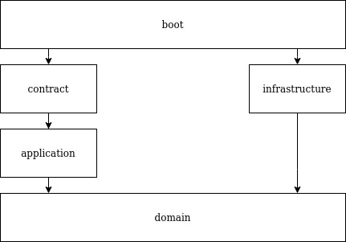

# Customer Service

The objective is to create a REST API to manage customer data for a small shop. It
will work as the backend side for a CRM interface that is being developed by a
different team.

As the lead developer of the backend project, you'll be in charge of the API design and implementation. Here are the requirements for the API:

## Requirements:

* The API should be only accessible by a registered user by providing an
authentication mechanism.
* A user can only:
  * List all customers in the database.
  * Get full customer information, including a photo URL.
  * Create a new customer:
    * A customer should have at least name, surname, id and a photo field.
    * Name, surname and id are required fields.
    * Image uploads should be able to be managed.
    * The customer should have a reference to the user who created it.
    * Update an existing customer.
      * The customer should hold a reference to the last user who modified it.
    * Delete an existing customer.
* An admin can also:
  * Manage users:
    * Create users.
    * Delete users.
    * Update users.
    * List users.
    * Change admin status.

## Technologies used:
* Spring boot 3.0.2
* Java 17
* Maven 3
* Docker compose
* Postgresql
* Keycloak as oauth2 server

## Api Rest definition:
The api is defined in the file [api.yml](src%2Fmain%2Fresources%2Fapi.yml) and the api code is generated using the openapi code generator from spring.

The classes are generated in `/target/generated-sources/openapi/src`.

The openapi generator is configured to generate
* Model objects.
* Api files with the operations. It contains the methods we overwrite in the controllers.

## Project arquitecture:
Trying to find a low coupling code, easy to maintain and change I chose a based Hexagonal architecture.

### Boot
* **Description:** This layer is the one from where the application is boot and it's the glue
  between the other layers.
* **Content:** Java Main class to boot the application, dependency injection configuration of
  components in application/domain layer (we avoid using Spring annotations in those layers).
* **Internal dependencies:** contract & infrastructure layers.
* **External dependencies:** not restricted.
* **Tests categories:**  in-process component tests, out of process component tests.
* **Packages:** com.bernalvarela.customerservice.boot
  * configuration: Dependency injection configuration.

### Contract
* **Description:** This layer is the requests entry point for other services.
* **Content:** classes to handle, configure and model service requests and responses.
* **Internal dependencies:** application.
* **External dependencies:** not restricted.
* **Tests categories:** contract tests.
* **Packages:** com.bernalvarela.customerservice.contract
  * **rest:**
    * **configuration:** REST configuration (serializers, adapters, security, controllerAdvice,...).
    * **controller:** classes which implements API-first classes generated. **Naming: __{Entity}__Controller**.
    * **mapper:** mappers between resources and application layer DTOs generated by open api.

### Application
* **Description:** This layer is where the use cases are implemented.
* **Content:** services, DTOs and mappers.
* **Internal dependencies:** domain layer.
* **External dependencies:** javax validation library and hibernate validator
  (scope test). No fwk dependencies are allowed.
* **Tests categories:** solitary unit tests.
* **Packages:** com.bernalvarela.customerservice.application
  * **service:** use cases are split in small steps that are implemented as services.

### Domain
* **Description:** This layer is the heart of the service. It is where all the business logic
  should be implemented. Application layer should use objects of domain layer and coordinate
  them, but the business logic should be on the objects of this layer.
* **Content:** entities, domain services, value objects, repositories interfaces, domain
  events,...
* **Internal dependencies:** no one.
* **External dependencies:** no one.
* **Tests categories:** sociable unit tests.
* **Package:** com.bernalvarela.customerservice.domain
  * **model:** domain entities.
  * **exception:** domain exceptions. This exceptions have to make sense in terms of the domain. No
  technical exceptions have to be here.
  * **repository:** domain repositories. In this layer, there are interfaces, the implementations
  have to be on the infrastructure layer. Each aggregation root entity (and only the root) should
  have a repository. The name of the method of the repositories should be expressed in terms of
  the domain and not with technical descriptions. Naming: _{aggregationRootEntity}Repository__.

### Infrastructure
* **Description:** The implementation details of domain repositories can be found here. In this
  layer is where tech decisions are taken. For instance: DBs used, concurrency techniques.
* **Content:** every class required to implement domain repositories and apply patterns and
  techniques required.
* **Internal dependencies:** domain.
* **External dependencies:** not restricted.
* **Tests categories:** solitary unit tests and integration tests.
* **Package:** com.bernalvarela.customerservice.infrastructure
  * **repository:** Domain repositories interfaces implementations.

## Launch application and tests:
### What do you need?
To run the project and tests you need to install on your computer:
* Java >= 17
* Docker
* Docker-compose

### Before run
Before running the project you have to launch the docker images configured in the docker-compose file.

* `docker-compose up`

For this project we are using:
* Postgresql to persistency. (Port: 5432, User: postgres, Password: 123)
* Keycloak for oauth2 authentication. (Port: 28080) 

### Run tests and project
This project brings maven wrapper that's why we don't need to install it.
* To run the tests we have to run:
  * `./mvnw test` This command will launch all the controller, service and repository tests.
* To run the application we to run:
  * `./mvnw spring-boot:run` This command will launch the service in the port 8080.

The operations and the body content are defined in the [openapi](src%2Fmain%2Fresources%2Fapi.yml) file.

## TODO:

List of pending tasks:

* Configure the project to use the oauth2 server to authenticate. At this moment the service is running with a profile bypassing the authentication. I created the [configuration](src%2Fmain%2Fjava%2Fcom%2Fbernalvarela%2Fcustomerservice%2Fcontract%2Fconfiguration%2FSecurityConfigProd.java) but i was not able to make the application recover the roles info.
* Configure the project to launch the service and tests in a docker image.
